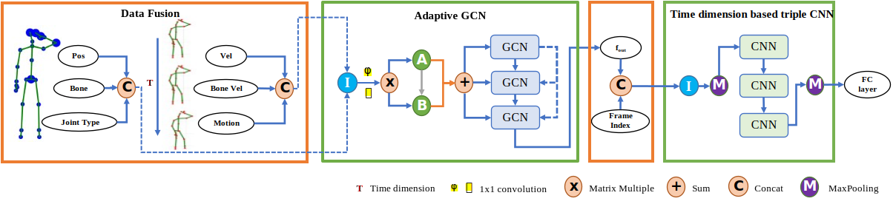
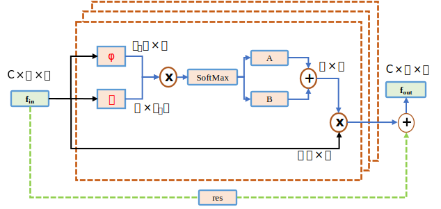

# SAGN: Semantic Adaptive Graph Network for Skeleton-Based Human Action Recognition

## Introduction

We propose a semantic and adaptive graph network (SAGN) with relatively little computation. Figure~\ref{fig:networks} shows the overall framework. Specifically, we fuse the dynamic feature information (position information, motion information and velocity information) with the bone information (bone information and bone information based on velocity difference), and add the semantic information (joint type and frame index). The whole information fusion is carried out by means of splicing. The fused data is put into the three-layer adaptive GCN for learning, highlighting its adaptability and dynamic learning of graph structure. And the adjacency matrix of graph convolution is obtained by self-learning. The structure learned through the adaptive GCN is spliced with the semantic information of the frame index. In the process of CNN, three layers are designed, which are mainly used for feature extraction of time dimension. In the whole process, we test the model on two public datasets, NTU-RGB+D 60 and NTU-RGB+D 120, and get a good result.

## Framework



Figure 1: Framework of the proposed  semantic and adaptive graph network (SAGN). In the data fusion part, we fuse dynamic feature information, bone information and the joint types in the semantic information, and the fusion is carried out through splicing. In the adaptive GCN part, we designed a three-layer graph convolution structure, and learned the graph structure of each sample using the idea of residuals. We splice the learned graph structure and frame index in semantic information to get new fusion data. In the time dimension based triple CNN part, we design a three-layer convolution operation with two MaxPooling.



Figure 2: The working mechanism of adaptive GCN. There are two types of adjacency matrices, $\theta$ and $\varphi$ changes the dimensions of the original data $f_{in}$ from $C \times V \times T$ to $V \times C_e*T$ and $C_e*T \times V$ through transformation. The adjacency matrix $A$ and $B$ are obtained by matrix multiplication. Among them, the dimension of $B$ is the same as that of $B$, but other parameters in the $B$ network are optimized for training without any constraints and can be any element. The result of adding $A$ and $B$ is multiplied by the original data to get the graph structure, and the final $f_{out}$ is obtained through the residual structure. The dimension of $f_{out}$ is the same as the dimension of the original data $f_{in}$.

## Prerequisites

The code is built with the following libraries:

+ Python 3.6
+ [Anaconda](https://www.anaconda.com/)
+ [PyTorch](https://pytorch.org/) 1.3

## Data Preparation

We use the dataset of NTU60 RGB+D as an example for description. We need to first dowload the [NTU-RGB+D](https://github.com/shahroudy/NTURGB-D) dataset.

+ Extract the dataset to ./data/ntu/nturgb+d_skeletons/
+ Process the data

```python
 cd ./data/ntu
 # Get skeleton of each performer
 python get_raw_skes_data.py
 # Remove the bad skeleton 
 python get_raw_denoised_data.py
 # Transform the skeleton to the center of the first frame
 python seq_transformation.py
```

## Training

```python
# For the X-Sub setting
python  main.py --network SGN --train 1 --case 0
# For the X-View setting
python  main.py --network SGN --train 1 --case 1
```

## Testing

+ Test the pre-trained models (./results/NTU/SGN/)

```python
# For the X-Sub setting
python  main.py --network SGN --train 0 --case 0
# For the X-View setting
python  main.py --network SGN --train 0 --case 1
```

## Reference

+ Note that some codes references [SGN](https://github.com/microsoft/SGN)